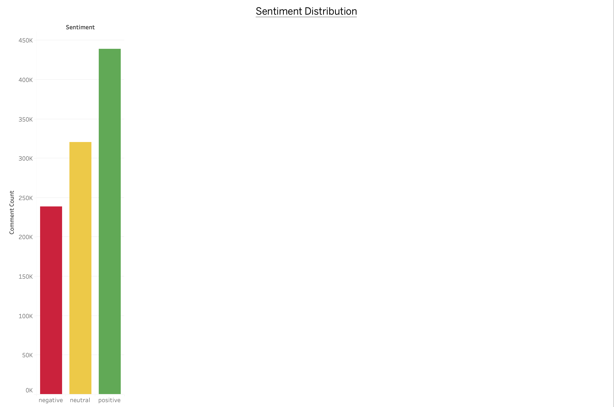
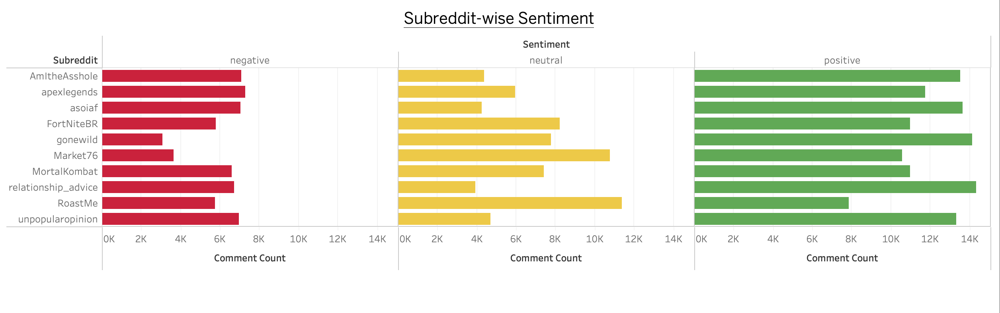
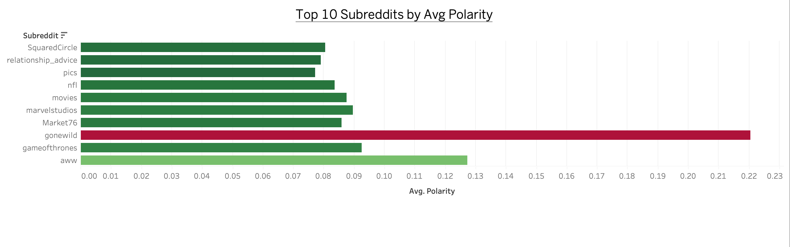

# 📊 Social Media Sentiment Analysis on Reddit

This project performs sentiment analysis on Reddit comments using Python and visualizes the results using Tableau.

## 🧠 Tools Used

- Python (Pandas, TextBlob, Seaborn, Matplotlib)
- Tableau (for interactive dashboards)
- Jupyter Notebook

## 🔍 Project Features

- Cleaned and processed over 280,000 Reddit comments
- Classified each comment as Positive, Negative, or Neutral using TextBlob
- Extracted average polarity per subreddit
- Built Tableau visualizations:
  - Overall sentiment distribution
  - Subreddit-wise sentiment breakdown
  - Avg. polarity by subreddit with color scale

## 📈 Visualizations

### Sentiment Distribution

### Subreddit Sentiment

### Avg Polarity by Subreddit

